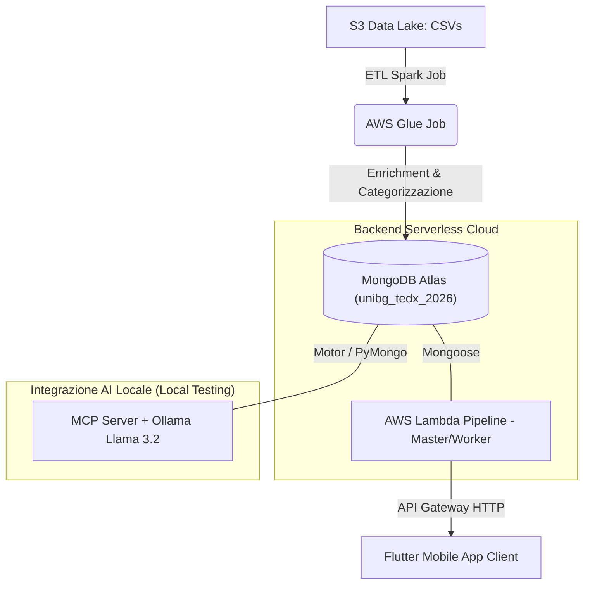

# Shift-X: Recommendation Engine di Talk TEDx basato sul Career Path

Benvenuto nella repository ufficiale di **Shift-X**, un progetto universitario per l'esame di **Piattaforme Cloud** (Anno Accademico 2025/2026, Università degli Studi di Bergamo). 

Shift-X è una piattaforma serverless e AI-native che mappa il ruolo professionale (o il percorso di carriera desiderato) di un utente a una playlist personalizzata e ordinata di **talk TEDx** rilevanti per la sua crescita e ispirazione.

---

## 🏗️ Architettura Generale del Sistema

Il sistema si compone di quattro sotto-progetti principali che coprono l'intero ciclo di vita del dato, dall'ingestione all'interazione dell'utente finale:




1. **[Progetto 1 (Presentazione)](./Progetto1/)**: Slide e materiale di presentazione dell'intero progetto Shift-X, che ne illustra gli obiettivi, l'architettura cloud e i risultati.
2. **[Progetto 2 (ETL & Data Enrichment)](./Progetto2/)**: Pipeline Spark su **AWS Glue** per l'elaborazione dei dataset memorizzati su **Amazon S3**, l'arricchimento dei talk, il calcolo deterministico delle macro-categorie ed il caricamento su **MongoDB Atlas**.
3. **[Progetto 3 (Backend Lambda & MCP Server)](./Progetto3/)**:
   - **Full AWS Serverless**: 5 funzioni Lambda orchestrate da una Lambda Master ed esposte tramite **API Gateway** per consentire l'estrazione deterministica di categorie, tag e playlist di talk.
   - **AI-Native Integration (MCP & Ollama)**: Un server **Model Context Protocol (MCP)** e un'orchestratore **FastAPI** che utilizzano un LLM locale (**Ollama Llama 3.2**) per dedurre in modo intelligente categorie e tag dai job complessi.
4. **[Progetto 4 (Flutter Mobile Client)](./Progetto4/)**: Client mobile multipiattaforma in **Flutter** con interfaccia premium ispirata a Netflix/TEDx, che interroga gli endpoint per generare playlist e guardare video correlati ("Watch Next").

---

## 🛠️ Tecnologie Utilizzate

### Cloud & Infrastruttura (AWS & NoSQL)
- **Amazon S3**: Data Lake per i dataset grezzi dei talk TEDx in formato CSV.
- **AWS Glue**: Servizio ETL serverless basato su Apache Spark per la manipolazione distribuita di dati.
- **AWS Lambda**: Elaborazione serverless FaaS (Node.js) per gli endpoint della pipeline.
- **AWS API Gateway**: Esposizione degli endpoint REST/HTTP pubblici con supporto CORS.
- **AWS IAM**: Ruoli e policy per il controllo dei permessi (invocazione Lambda, accessi MongoDB).
- **MongoDB Atlas**: Database NoSQL cloud per la persistenza dei documenti di talk pre-elaborati.

### Linguaggi di Programmazione e Framework
- **Python**: Utilizzato per il Glue Job (PySpark) e per l'integrazione AI (FastAPI, MCP Server, Motor).
- **JavaScript (Node.js)**: Utilizzato per le funzioni Lambda e l'integrazione Mongoose.
- **Dart (Flutter)**: Utilizzato per lo sviluppo dell'applicazione client per dispositivi mobili.

### Intelligenza Artificiale & Standard
- **Model Context Protocol (MCP)**: Protocollo standard aperto di Anthropic per la connessione sicura tra LLM e database.
- **Ollama (Llama 3.2: 3B)**: LLM open-source eseguito localmente per la comprensione semantica del ruolo lavorativo.

---

## 📂 Struttura della Repository

```
Shift-X/
├── Progetto1/        # Materiale di presentazione in PDF (SHIFT-X - Presentazione.pdf)
├── Progetto2/        # Script PySpark del Job AWS Glue (ShiftX_Glue_Job.py) e documentazione
├── Progetto3/        # Funzioni Lambda (Node.js), Script MCP Server, API FastAPI e layer zip
└── Progetto4/        # Codice sorgente dell'app mobile Flutter (shift_x_flutter)
```

Per i dettagli specifici di ciascun modulo e le istruzioni di deploy/configurazione, consulta i file `README.md` all'interno delle rispettive cartelle.